# 14 — Arsitektur Sistem per Tahap (T1 sampai T5)

Status: revisi 2026-09-14, menggantikan versi 2026-09-13. Dokumen ini menjelaskan susunan sistem IRAMA pada tiap tahap untuk pembaca berlatar strategi IT, mengikuti tahapan baru di `04`. Rincian teknologi, lisensi, dan ADR ada di `06`; spesifikasi Vision Tracker dan modul optimasi ada di `15`; daftar fitur per tahap ada di `05`; pengadaan ada di `11`.

## 1. Arsitektur alur data, komponen, dan teknologi (A01)

Diagram A01 merangkum alur kerja IRAMA dari kamera sampai keputusan. Video dari CCTV diolah Vision Tracker menjadi tabel hitungan per kelas kendaraan, per arah, dan per 15 menit. Tabel itu disimpan bersama konfigurasi simpang, lalu diolah modul Optimasi Waktu Simpang menjadi rekomendasi waktu siklus dan waktu hijau. Hasilnya tampil di dashboard dan laporan kajian sebagai bahan keputusan engineer dan Kepala Dinas. Setiap kotak mencantumkan teknologi yang dipakai dalam huruf miring.

Cara membaca diagram:

- Label warna di pojok kanan atas kotak menunjukkan tahap saat komponen itu pertama tersedia. T1 hijau, T2 biru, T3 jingga, T4 ungu, T5 merah.
- Untuk melihat kondisi sistem pada tahap tertentu, abaikan kotak dengan tahap lebih tinggi. Pada T2, misalnya, alur berjalan dari rekaman atau stream uji, melalui Vision Tracker dan optimasi, sampai dashboard, laporan, keputusan, dan penerapan manual oleh petugas.
- Panah tegak di dalam kolom menunjukkan urutan proses. Panah antarkolom menunjukkan data yang berpindah ke bagian berikutnya.
- Garis jingga di bawah kolom adalah jalur kejadian mulai T3. Peristiwa seperti ambulans lewat atau kamera tertutup langsung dikirim ke konsol pemantauan tanpa melalui optimasi.
- Garis putus-putus adalah umpan balik mulai T3. Setelah jadwal baru diterapkan, rekaman sesudahnya diukur ulang untuk membuktikan perubahan kinerja simpang.

Rincian komponen, teknologi, dan tahap:

| Kolom | Komponen | Teknologi | Tahap |
|---|---|---|---|
| Sumber video | Rekaman CCTV dan video publik | MP4/MKV, register sumber rekaman | T1 |
| Sumber video | Stream CCTV | RTSP/HLS/ONVIF; uji lewat MediaMTX (T2), stream Dishub setelah MoU (T3) | T2 |
| Vision Tracker | Ambil bingkai | FFmpeg, OpenCV | T1 |
| Vision Tracker | Deteksi enam kelas kendaraan | RF-DETR/YOLOX lewat ONNX Runtime (CPU/iGPU) | T1 |
| Vision Tracker | Pelacakan dan hitung per pendekat | ByteTrack, supervision; arah dari lintasan (T2) | T1 |
| Vision Tracker | Hambatan samping, nyala lampu, antrian | logika IRAMA, OpenCV; penyamaran wajah dan pelat | T2 |
| Vision Tracker | Kejadian dan kesehatan kamera | model tambahan, aturan peringatan | T3 |
| Data terstruktur | Tabel hitungan 15 menit dan mutu data | PostgreSQL | T1 |
| Data terstruktur | Hambatan samping, status lampu, antrian | PostgreSQL (TimescaleDB opsional) | T2 |
| Data terstruktur | Konfigurasi simpang dan parameter | formulir (T1), wizard React + MapLibre (T2); PostgreSQL + PostGIS | T1 |
| Data terstruktur | Peristiwa kejadian dan kesehatan kamera | PostgreSQL, klip bukti tersamarkan | T3 |
| Optimasi waktu simpang | Konversi SMP dan periode | Python, EMP PKJI 2023; periode otomatis (T2) | T1 |
| Optimasi waktu simpang | Kalkulator PKJI 2023 | NumPy, modul PKJI IRAMA; mode MKJI 1997 (T2) | T1 |
| Optimasi waktu simpang | Mode optimasi | SciPy; Webster (T1), empat mode (T2), multi-kriteria (T3) | T1 |
| Optimasi waktu simpang | Validasi simulasi | SUMO, TraCI | T2 |
| Optimasi waktu simpang | Manfaat rupiah | parameter UMK, BBM, emisi | T2 |
| Penyajian dan keputusan | Dashboard simpang | React, ECharts; versi dasar (T1), tiga halaman (T2) | T1 |
| Penyajian dan keputusan | Laporan kajian Word/PDF | python-docx, LibreOffice | T2 |
| Penyajian dan keputusan | Keputusan engineer dan Kepala Dinas | persetujuan dan jejak audit | T2 |
| Penyajian dan keputusan | Konsol pemantauan kejadian | React; notifikasi email/WhatsApp | T3 |
| Tindak lanjut | Penerapan manual oleh petugas | lembar jadwal dari dashboard atau laporan | T2 |
| Tindak lanjut | Ekspor jadwal dan uji sebelum-sesudah | format tabel, NTCIP baca-saja | T3 |
| Tindak lanjut | Kendali controller dan adaptif | adaptor NTCIP/vendor, edge, MQTT | T4 |
| Tindak lanjut | Koordinasi koridor dan jaringan | offset, bandwidth, Link Pivot; twin kota | T5 |
| Tindak lanjut | Tiket kerja dan tindak lanjut kejadian | tiket, email/WhatsApp, laporan wajib | T3 |

Versi teks (mermaid):

```mermaid
flowchart LR
  subgraph C0["Sumber video"]
    V1["Rekaman CCTV dan video publik (T1)<br/><i>MP4/MKV, register sumber rekaman</i>"]
    V2["Stream CCTV (T2)<br/><i>RTSP/HLS/ONVIF; uji lewat MediaMTX (T2), stream Dishub setelah MoU (T3)</i>"]
  end
  subgraph C1["Vision Tracker"]
    A1["Ambil bingkai (T1)<br/><i>FFmpeg, OpenCV</i>"]
    A2["Deteksi enam kelas kendaraan (T1)<br/><i>RF-DETR/YOLOX lewat ONNX Runtime (CPU/iGPU)</i>"]
    A3["Pelacakan dan hitung per pendekat (T1)<br/><i>ByteTrack, supervision; arah dari lintasan (T2)</i>"]
    A4["Hambatan samping, nyala lampu, antrian (T2)<br/><i>logika IRAMA, OpenCV; penyamaran wajah dan pelat</i>"]
    A5["Kejadian dan kesehatan kamera (T3)<br/><i>model tambahan, aturan peringatan</i>"]
  end
  subgraph C2["Data terstruktur"]
    D1["Tabel hitungan 15 menit dan mutu data (T1)<br/><i>PostgreSQL</i>"]
    D2["Hambatan samping, status lampu, antrian (T2)<br/><i>PostgreSQL (TimescaleDB opsional)</i>"]
    D3["Konfigurasi simpang dan parameter (T1)<br/><i>formulir (T1), wizard React + MapLibre (T2); PostgreSQL + PostGIS</i>"]
    D4["Peristiwa kejadian dan kesehatan kamera (T3)<br/><i>PostgreSQL, klip bukti tersamarkan</i>"]
  end
  subgraph C3["Optimasi waktu simpang"]
    O1["Konversi SMP dan periode (T1)<br/><i>Python, EMP PKJI 2023; periode otomatis (T2)</i>"]
    O2["Kalkulator PKJI 2023 (T1)<br/><i>NumPy, modul PKJI IRAMA; mode MKJI 1997 (T2)</i>"]
    O3["Mode optimasi (T1)<br/><i>SciPy; Webster (T1), empat mode (T2), multi-kriteria (T3)</i>"]
    O4["Validasi simulasi (T2)<br/><i>SUMO, TraCI</i>"]
    O5["Manfaat rupiah (T2)<br/><i>parameter UMK, BBM, emisi</i>"]
  end
  subgraph C4["Penyajian dan keputusan"]
    P1["Dashboard simpang (T1)<br/><i>React, ECharts; versi dasar (T1), tiga halaman (T2)</i>"]
    P2["Laporan kajian Word/PDF (T2)<br/><i>python-docx, LibreOffice</i>"]
    P3["Keputusan engineer dan Kepala Dinas (T2)<br/><i>persetujuan dan jejak audit</i>"]
    P4["Konsol pemantauan kejadian (T3)<br/><i>React; notifikasi email/WhatsApp</i>"]
  end
  subgraph C5["Tindak lanjut"]
    R1["Penerapan manual oleh petugas (T2)<br/><i>lembar jadwal dari dashboard atau laporan</i>"]
    R2["Ekspor jadwal dan uji sebelum-sesudah (T3)<br/><i>format tabel, NTCIP baca-saja</i>"]
    R3["Kendali controller dan adaptif (T4)<br/><i>adaptor NTCIP/vendor, edge, MQTT</i>"]
    R4["Koordinasi koridor dan jaringan (T5)<br/><i>offset, bandwidth, Link Pivot; twin kota</i>"]
    R5["Tiket kerja dan tindak lanjut kejadian (T3)<br/><i>tiket, email/WhatsApp, laporan wajib</i>"]
  end
  V1 --> A1
  V2 --> A1
  A1 --> A2
  A2 --> A3
  A3 --> A4
  A4 --> A5
  A3 --> D1
  A4 --> D2
  A5 --> D4
  D1 --> O1
  D2 --> O2
  D3 --> O2
  O1 --> O2
  O2 --> O3
  O3 --> O4
  O4 --> O5
  O3 --> P1
  O4 --> P1
  O5 --> P1
  P1 --> P2
  P2 --> P3
  P3 --> R1
  P3 --> R2
  P3 --> R3
  R3 --> R4
  P4 --> R5
  D4 -->|T3: peristiwa kejadian langsung ke konsol pemantauan, tanpa melalui optimasi| P4
  R2 -.->|T3: uji sebelum-sesudah; rekaman sesudah penerapan diukur ulang oleh Vision Tracker| V2
```

## 2. Cara membaca arsitektur per tahap

Sistem selalu terdiri dari lima lapisan yang sama, dari jalan sampai layar pengguna. Tiap tahap menambah kemampuan pada lapisan tertentu tanpa membongkar tahap sebelumnya.

| Lapisan | Isi | Analogi |
|---|---|---|
| Lapangan | kamera CCTV yang sudah dimiliki Dishub dan rekamannya; mulai T3 controller dibaca tanpa diubah; mulai T4 komputer kecil di kabinet (edge), kamera ANPR khusus, dan controller yang dikendalikan dari pusat | cabang atau gerai |
| Komunikasi | T1 dan T2 berupa berkas rekaman yang disalin; T3 stream Dishub lewat VPN setelah MoU; T4 jaringan fiber atau seluler dengan enkripsi dua arah | jaringan antarcabang |
| Pusat | Vision Tracker, modul optimasi, basis data, dan simulasi. Berjalan di laptop tim sampai T3, di server pemda atau cluster kecil di T4, dan di cloud atau pusat data pemerintah di T5 | kantor pusat dan gudang data |
| Integrasi | sambungan ke sistem lain: aduan kota mulai T3; Polri, operator bus, pemadam dan ambulans, Bapenda, DLH, dan pengelola tol mulai T4; API publik mulai T5 | kemitraan |
| Penyajian | wizard konfigurasi, dashboard, dan laporan; konsol pemantauan mulai T3; ruang kendali dan video wall mulai T4; portal data mulai T5 | etalase dan laporan manajemen |

Aturan berikut berlaku sejak T1 dan tidak berubah di tahap mana pun.

1. Tanpa pengadaan sampai T3 selesai. Semua komponen T1 sampai T3 berjalan di laptop tim dengan perangkat lunak berlisensi bebas, dan pelatihan model memakai layanan GPU gratis.
2. Keputusan tetap di tangan manusia. Sampai T3 sistem hanya memberi rekomendasi dan bukti; petugas yang menerapkan jadwal di controller. Kendali lampu dari pusat baru dimulai di T4.
3. Lampu tetap bekerja sendiri bila pusat mati. Sejak kendali tersambung di T4, controller menyimpan minimal delapan jadwal lokal (PM 49/2014), pusat hanya mengirim perintah terbatas dan detak jantung berkala, dan perubahan jadwal dikirim sebagai transaksi yang diperiksa dulu.
4. Setiap angka dapat ditelusuri. Hitungan terhubung ke rekaman dan versi model, rekomendasi ke konfigurasi dan rumus PKJI 2023, dan keputusan ke persetujuan pejabat yang berwenang.
5. Data disimpan hemat. Video mentah dihapus setelah diolah kecuali sampel validasi yang disamarkan; yang disimpan lama hanya angka dan peristiwa.
6. Standar terbuka di setiap sambungan: RTSP, ONVIF, dan HLS untuk kamera; ONNX untuk model; NTCIP untuk controller; format ekspor terbuka untuk data.

## 3. Tahap 1, Purwarupa Hitung dan Rekomendasi

Gambaran singkat: meja kerja engineer lalu lintas yang mengubah rekaman CCTV satu simpang menjadi rekomendasi waktu sinyal. Belum ada sambungan ke kamera atau lampu sungguhan.

| Lapisan | Yang ada di T1 |
|---|---|
| Lapangan | tidak ada perangkat baru; rekaman dari CCTV yang sudah ada atau video publik (lihat `13`) |
| Komunikasi | berkas rekaman disalin ke laptop |
| Pusat | laptop tim menjalankan Vision Tracker (FFmpeg dan OpenCV untuk membaca video, model deteksi lewat ONNX Runtime, pelacakan ByteTrack), basis data PostgreSQL, kalkulator PKJI 2023, dan mode optimasi Webster/PKJI baku |
| Integrasi | tidak ada |
| Penyajian | formulir konfigurasi simpang dan dashboard dasar (volume, kapasitas, derajat kejenuhan, tundaan, LOS, rekomendasi) |

Alur data: rekaman per pendekat didaftarkan beserta sumbernya. Vision Tracker mengambil sekitar sepuluh bingkai per detik, mendeteksi dan melacak enam kelas (motor, mobil, bus, truk, kendaraan tak bermotor, pejalan kaki), lalu menghitung kendaraan yang melewati garis hitung per pendekat per 15 menit. Tabel hitungan dikonversi ke arus SMP dengan EMP PKJI 2023. Kalkulator menghitung arus jenuh, kapasitas, derajat kejenuhan, antrian, dan tundaan. Mode Webster/PKJI baku menghasilkan waktu siklus dan pembagian hijau yang lolos validator keselamatan (kuning, merah semua, hijau minimum), dan hasilnya tampil di dashboard dasar.

Mengapa disusun begini: seluruh alur bisa dibangun dan didemokan tim dua orang tanpa izin lapangan dan tanpa biaya. Model, skema tabel, dan kalkulator yang dipakai sama dengan T2, sehingga pekerjaan T1 langsung terpakai di tahap berikutnya.

Ukuran dan komputasi: satu simpang dengan rekaman terbatas. Laptop tim (Ryzen 7 7730U, RAM 32 GB, GPU terintegrasi) cukup untuk mengolah rekaman per batch. Pelatihan model memakai GPU gratis Kaggle atau Colab sesuai `16`.

## 4. Tahap 2, Vision Tracker dan Optimasi Simpang

Gambaran singkat: perangkat lunak kajian waktu sinyal untuk engineer Dishub. Awalnya dijual sebagai jasa kajian yang dijalankan tim di laptop: Dishub menyerahkan rekaman, tim menyerahkan dashboard dan laporan.

| Lapisan | Tambahan di T2 |
|---|---|
| Lapangan | tidak ada perangkat baru; rekaman semua lengan satu simpang pada periode yang sama |
| Komunikasi | berkas rekaman; mode stream diuji dengan rekaman yang diputar ulang lewat server stream lokal MediaMTX (RTSP atau HLS), tanpa stream Dishub |
| Pusat | Vision Tracker lengkap: arah gerakan dari lintasan, hambatan samping berbobot PKJI, pembacaan nyala lampu, antrian dasar, penyamaran wajah dan pelat. Modul optimasi lengkap: periode otomatis, empat mode tambahan, pembanding MKJI 1997, manfaat rupiah. Ditambah simulasi SUMO dan pembuat laporan Word/PDF |
| Integrasi | tidak ada integrasi sistem; pertukaran dengan Dishub lewat berkas rekaman dan laporan |
| Penyajian | wizard konfigurasi dengan peta; dashboard tiga halaman (Ringkasan Simpang dan Rekomendasi; Arus Lalu Lintas dan Kapasitas; Kinerja Pendekat dan Kualitas Data); laporan kajian |

Alur data: engineer mengisi konfigurasi simpang lewat wizard, termasuk garis hitung dan zona pada gambar kamera. Vision Tracker menghasilkan tabel hitungan per kelas, per arah, dan per 15 menit, ditambah tabel hambatan samping, status lampu, dan antrian. Modul optimasi mengelompokkan profil 15 menit menjadi paling banyak delapan periode, menghitung kinerja kondisi eksisting dan rekomendasi untuk setiap mode, memvalidasinya di SUMO, dan menghitung manfaat rupiah. Engineer memilih rekomendasi, laporan dibuat otomatis, Kepala Dinas memutuskan, lalu petugas menerapkan jadwal secara manual di controller.

Mengapa disusun begini: nilai jual T2 adalah kajian yang cepat dan dapat dipertanggungjawabkan, tanpa mengganti alat di lapangan dan tanpa biaya pengadaan. Semua nilai antara, akurasi hitungan, dan perbedaan PKJI dengan simulasi ditampilkan agar engineer dapat memeriksa sendiri.

Ukuran dan komputasi: satu simpang lengkap. Laptop tim menjalankan dua sampai empat stream uji bersamaan. Rekaman 1080p berukuran sekitar 1,5 sampai 2 GB per jam per kamera, sehingga diolah per batch dan disimpan sementara di disk eksternal atau diperkecil ke 720p.

## 5. Tahap 3, Deteksi Kejadian dan Pemantauan Operasional

Gambaran singkat: ruang pantau kecil yang memberi peringatan kejadian dan menyusun laporan wajib, sekaligus membuktikan manfaat rekomendasi di lapangan. Masih tanpa pengadaan dan belum mengendalikan lampu.

| Lapisan | Tambahan di T3 |
|---|---|
| Lapangan | kamera Dishub yang ditunjuk dalam MoU; controller dibaca tanpa diubah bila Dishub mengizinkan |
| Komunikasi | stream Dishub lewat VPN setelah MoU, dibatasi pada sedikit kamera dan tidak berjalan 24 jam |
| Pusat | tetap di laptop tim. Vision Tracker menambah deteksi kendaraan prioritas, kejadian lalu lintas, pelanggaran sebagai bukti tanpa membaca pelat, kesehatan kamera dasar, kelas angkot dan pikap, penyeberang, dan kecepatan antarkamera. Optimasi menambah mode multi-kriteria dan skema fase alternatif. Ditambah tiket kerja, laporan wajib, dan kalibrasi twin per simpang |
| Integrasi | aduan kota (CRM) dua arah; baca status controller; ekspor lembar jadwal untuk petugas atau vendor |
| Penyajian | konsol pemantauan kejadian dengan notifikasi email atau WhatsApp; CCTV live view; dashboard publik sederhana |

Alur kejadian: Vision Tracker mendeteksi peristiwa, misalnya ambulans lewat, kendaraan mogok, atau kamera tertutup. Peristiwa disimpan bersama klip yang disamarkan, lalu langsung dikirim ke konsol pemantauan tanpa melalui modul optimasi. Operator menindaklanjuti, dan bila perlu sistem membuat tiket kerja.

Alur uji lapangan: Dishub menerapkan jadwal rekomendasi pada minimal satu simpang. Rekaman sesudah penerapan diolah Vision Tracker, lalu tundaan dan antrian dibandingkan dengan kondisi sebelum. Hasilnya menjadi bukti manfaat untuk anggaran T4.

Mengapa disusun begini: pemda mendapat nilai operasional sebelum membiayai perangkat. Deteksi kejadian memakai pipeline Vision Tracker yang sama, sehingga tidak perlu sistem kedua.

Ukuran dan komputasi: beberapa simpang yang dihitung mandiri; pilot live terbatas; tetap di laptop tim.

## 6. Tahap 4, Kendali Adaptif Terpadu

Gambaran singkat: kemampuan setara ITCS DKI dengan standar terbuka, yaitu kendali terpusat dan adaptif per simpang, koordinasi dasar, prioritas bus dan darurat, integrasi lintas instansi, dan ruang kendali skala kota. Pengadaan dimulai di tahap ini.

| Lapisan | Tambahan di T4 |
|---|---|
| Lapangan | edge (Jetson atau PC industri) di simpang kritis menjalankan Vision Tracker 24 jam sebagai detektor virtual; kamera ANPR khusus; controller NTCIP 1202/1211 atau adaptor untuk protokol vendor; keamanan kabinet mengikuti NEMA TS 8 |
| Komunikasi | MQTT dengan sertifikat dua arah (mTLS) untuk setiap edge; segmentasi jaringan; edge menyimpan data sementara bila jaringan putus |
| Pusat | server pemda atau cluster kecil tiga node. Layanan perintah dengan detak jantung dan transaksi; adaptif per simpang (actuated, pembagian hijau dengan batas perubahan per siklus, pemilihan program menurut kondisi); offset dasar dan green wave sederhana untuk simpang berdekatan; prioritas bus berbasis aturan dan prioritas kendaraan darurat bertingkat; prediksi volume 15 sampai 60 menit; mode bayangan; alarm controller dan detektor |
| Integrasi | pusat kendali Polri, Back Office ETLE (bukti diverifikasi Polri, aplikasi tidak menerbitkan tilang), CAD pemadam dan ambulans, AVL operator bus, Bapenda dan DLH melalui perjanjian, pengelola tol, cuaca |
| Penyajian | ruang kendali skala kota dengan video wall; konsol kendali dan konsol prioritas; aplikasi ponsel teknisi; laporan efektivitas ke Dirjen, BPTJ, dan Gubernur |

Alur kendali: operator atau petugas Polri memilih program, kedip, atau mode manual dari konsol. Layanan perintah memeriksa hak akses, lalu mengirim perintah terbatas beserta detak jantung. Bila jaringan putus, controller kembali ke jadwal lokal dan edge menyimpan catatan sampai jaringan pulih.

Alur adaptif: edge mengirim hitungan dan antrian setiap beberapa detik. Pusat memeriksa kesehatan detektor lebih dulu; bila detektor bermasalah, simpang kembali ke jadwal. Pembagian hijau disesuaikan dalam batas perubahan per siklus dengan hijau minimum yang menghormati pejalan kaki, dan offset simpang berdekatan dijaga agar green wave tidak putus.

Mengapa disusun begini: inti adaptif memakai metode yang stabil dan dapat dijelaskan. Semua algoritma baru melewati simulasi, uji dengan perangkat di meja, mode bayangan, jam sepi, lalu jam sibuk. Ukuran kinerja dari Vision Tracker menjadi pengamat independen untuk algoritma apa pun, termasuk milik vendor lain.

Ukuran dan komputasi: 50 sampai 300 simpang dalam satu kota. Server pemda atau cluster tiga node (16 inti dan 64 GB per node) ditambah edge di simpang kritis. Kapasitas penyimpanan ditetapkan lewat ADR-04.

## 7. Tahap 5, Platform Mobilitas Kota

Gambaran singkat: satu platform melayani banyak kota, mengoptimasi koridor dan jaringan, terbuka untuk algoritma pihak ketiga yang tervalidasi, dan menjadi dasar kebijakan pengelolaan permintaan perjalanan.

| Lapisan | Tambahan di T5 |
|---|---|
| Lapangan | fusi kamera dan radar untuk keselamatan pejalan kaki; siaran status lampu ke aplikasi navigasi (GLOSA) |
| Komunikasi | sama dengan T4, ditambah kanal ke penyedia navigasi |
| Pusat | optimasi koridor dan jaringan (bandwidth green wave, Link Pivot, max-pressure jaringan, pengendalian perimeter kawasan jenuh); prioritas bus bersyarat berbasis muatan dan keterlambatan; multi-tenant per kota dengan isolasi data; digital twin kota untuk uji kebijakan; pasar algoritma yang wajib lolos simulasi dan mode bayangan dengan veto statistik; kalkulator ambang pembatasan kendaraan; penasihat pembelajaran mesin yang hanya mengusulkan parameter |
| Integrasi | API publik dan data terbuka (UU 22/2009 Pasal 250), sistem ERP dan ganjil-genap pemprov, sistem informasi provinsi |
| Penyajian | benchmark antarkota untuk Kemenhub dan BPTJ, portal data terbuka, pelatihan operator bersertifikat |

Mengapa disusun begini: optimasi koridor baru bernilai setelah banyak simpang terhubung dan terbukti andal di T4. Pemda kecil dapat berbagi platform, kementerian dapat mengawasi efektivitas banyak kota, dan riset kampus dapat masuk ke lapangan dengan aman.

Infrastruktur: cloud atau pusat data pemerintah dengan skala otomatis.

## 8. Ringkasan lapisan per tahap

| Lapisan | T1 | T2 | T3 | T4 | T5 |
|---|---|---|---|---|---|
| Lapangan | rekaman CCTV yang ada | rekaman semua lengan satu simpang | kamera Dishub (MoU), controller baca-saja | edge, kamera ANPR, controller dikendalikan | fusi radar, GLOSA |
| Komunikasi | salin berkas | stream uji lokal dari rekaman | stream Dishub lewat VPN | MQTT, mTLS, segmentasi | kanal navigasi |
| Pusat | laptop: Vision Tracker dasar, PKJI, Webster | laptop: Vision Tracker dan optimasi lengkap, SUMO, laporan | laptop: kejadian, kesehatan kamera, tiket, laporan wajib, multi-kriteria | server atau cluster: kendali, adaptif per simpang, offset dasar, prioritas | cloud: banyak kota, optimasi jaringan, twin kota, pasar algoritma |
| Integrasi | tidak ada | tidak ada (berkas) | aduan kota, baca controller, ekspor jadwal | Polri/ETLE, CAD, AVL, Bapenda, DLH, tol, cuaca | API publik, ERP/TDM, provinsi |
| Penyajian | formulir, dashboard dasar | wizard, dashboard tiga halaman, laporan | konsol pemantauan, live view, dashboard publik | ruang kendali kota, video wall, konsol kendali | benchmark antarkota, portal data |
| Peran sistem | rekomendasi untuk demo | rekomendasi yang diterapkan petugas | rekomendasi, peringatan, uji lapangan | kendali adaptif per simpang dan koordinasi dasar | optimasi koridor dan jaringan, algoritma pihak ketiga |
| Pengadaan | tidak ada | tidak ada | tidak ada | edge, kamera ANPR, adaptor controller | sesuai kontrak |

## 9. Bagian yang tidak berubah sepanjang tahap

- Satu skema tabel hitungan dan satu mesin PKJI dipakai dari T1 sampai T5. Data dari rekaman, stream, dan edge masuk ke tabel yang sama.
- Model deteksi dan dataset milik tim dan pemda, disimpan dalam format ONNX, dan dapat dilatih ulang tanpa bergantung pada vendor.
- Satu model data untuk semua jenis controller, baik standar NTCIP maupun vendor lokal, dipakai mulai T3 sehingga adaptor baru tidak mengubah aplikasi.
- Urutan validasi untuk setiap perubahan cara kendali: hitung PKJI, simulasi SUMO, uji lapangan (T3), mode bayangan (T4), jam sepi, jam sibuk, lalu perbandingan hidup-mati.
- Hierarki cadangan mulai T4: adaptif turun ke jadwal terpusat, lalu jadwal lokal di controller, lalu aktuasi bebas, lalu kedip, dan terakhir pengaturan manual petugas. Setiap penurunan tercatat dan menjadi alarm.
- Kepemilikan data di tangan pemda. Akses pihak lain lewat perjanjian, dan data pribadi (wajah, pelat) diproses hanya dengan dasar hukum dan retensi singkat.

## 10. Risiko arsitektur dan cara menguranginya

| Risiko | Dampak | Pengurangan |
|---|---|---|
| Akurasi Vision Tracker turun pada malam, hujan, atau motor yang berhimpitan | hitungan dan rekomendasi keliru | target bertahap (sekitar 90% dan 85% di T1-T2, 95% dan 90% mulai T3); halaman kualitas data; koreksi oleh engineer; pelatihan ulang dengan contoh yang salah |
| Rekaman terbatas dan berasal dari simpang berbeda | uji akurasi dan optimasi kurang mewakili | rekaman gabungan hanya untuk uji akurasi; optimasi memakai hitungan semua lengan pada periode yang sama; kebutuhan rekaman di `13` |
| Laptop kurang kuat untuk rekaman panjang atau banyak stream | proses lambat | model ringan (YOLOX-tiny) untuk operasi; olah per batch; resolusi 720p; pelatihan di GPU gratis |
| Ukuran video besar | disk laptop penuh | video mentah dihapus setelah diolah; disk eksternal; resolusi 720p |
| Hak cipta video publik | sengketa bila produk dijual luas | register sumber; pelatihan ulang dengan data berizin sebelum penjualan skala besar |
| Lisensi pustaka pihak ketiga berubah | kode harus diganti | pemeriksaan lisensi otomatis di CI; daftar larangan; alternatif berlisensi permisif |
| MoU dan akses stream tertunda | T3 tertahan | deteksi kejadian tetap dikembangkan dengan rekaman; kuesioner `12` |
| Protokol controller vendor tertutup (T4) | adaptor tidak bisa dibangun | kuesioner `12`; perjanjian kerahasiaan dengan vendor; pencatat di edge sebagai cadangan; NTCIP untuk pengadaan baru |
| Jaringan Dishub sering putus (T4) | data hilang, kendali terputus | penyimpanan sementara di edge 24 sampai 72 jam; controller selalu punya jadwal lokal |
| Kewenangan Polri dan Dirjen/BPTJ | penerapan jadwal tertahan | alur persetujuan dalam aplikasi; laporan kajian berformat standar; integrasi pusat kendali Polri di T4 |
| Tim kecil tanpa teknisi lapangan (T4) | pemasangan edge tertunda | pemasangan dengan checklist oleh teknisi Dishub atau vendor dan dukungan jarak jauh |
