## 9. Diagram alur fitur utama dan pemetaannya ke arsitektur dan tahap

Diagram berikut menggambarkan cara IRAMA bekerja pada kondisi end-state, satu diagram per fitur utama. Cara membacanya sama untuk semua diagram.

- Baris (lajur mendatar) adalah lapisan arsitektur: pengguna dan mitra eksternal, penyajian, pusat, komunikasi dan integrasi, lapangan. Posisi kotak menunjukkan komponen mana yang menjalankan langkah itu.
- Kotak adalah langkah, diberi huruf urut dan warna bingkai. Label kecil di pojok kanan atas (T1 sampai T5) menandai tahap saat langkah itu pertama tersedia. Warna: T1 hijau, T2 biru, T3 jingga, T4 ungu, T5 merah.
- Panah adalah aliran data atau perintah. Label abu-abu pada panah menjelaskan kondisi, misalnya "bila putus". Label berwarna, misalnya T3, berarti hubungan itu baru ada mulai tahap tersebut.
- Untuk membaca diagram pada tahap tertentu, abaikan kotak yang labelnya lebih tinggi dari tahap itu. Contoh: pada T2, kotak berlabel T3 sampai T5 belum ada, dan alur berhenti pada kotak terakhir yang tersedia.

Tabel di bawah tiap diagram memetakan langkah ke komponen dalam struktur repositori (apps, services, edge, sim, infra) dan tahapnya. Diagram direvisi 2026-09-14 mengikuti tahapan baru: T1 purwarupa, T2 Vision Tracker dan optimasi, T3 deteksi kejadian dan pemantauan, T4 kendali adaptif, T5 platform kota. Diagram arsitektur alur data per komponen dan teknologi (A01) ada di dokumen 14.

### F00 Gambaran keseluruhan komponen per lapisan dan tahap

Diagram ini memperlihatkan semua komponen yang ada pada end-state, dikelompokkan per lapisan, dengan label tahap pemunculannya. Diagram F01 sampai F12 memperlihatkan bagaimana komponen tersebut bekerja sama untuk tiap fitur.

### F01 Pemantauan kondisi simpang

Kondisi setiap simpang (arus, LOS, nyala lampu, peringatan) terlihat di dashboard. T1 dan T2 memakai data dari rekaman melalui Vision Tracker; T3 menambah stream Dishub dan status controller baca-saja; T4 menambah edge dan kendali.

Tahap yang terlibat: T1, T2, T3, T4. Langkah dan komponennya:

| Langkah | Lapisan | Komponen | Tahap |
|---|---|---|---|
| a. Rekaman atau stream CCTV simpang | Lapangan | kamera eksisting, berkas rekaman | T1 |
| b. Controller dibaca tanpa diubah, bila Dishub mengizinkan | Lapangan | controller vendor/NTCIP | T3 |
| c. Agen edge di kabinet menerjemahkan protokol vendor | Lapangan | edge/ | T4 |
| d. Stream Dishub lewat VPN setelah MoU; MQTT dan mTLS di T4 | Komunikasi | infra/ (MediaMTX, VPN) | T3 |
| e. Vision Tracker menghitung arus (T1) dan membaca nyala lampu (T2) | Pusat | services/vision | T1 |
| f. Aturan peringatan (lampu mati atau kedip, kamera bermasalah) | Pusat | services/health | T3 |
| g. Peta simpang, LOS, dan kondisi terkini di dashboard | Penyajian | apps/tmc-web (MapLibre) | T2 |
| h. Engineer, operator, dan pimpinan memantau | Pengguna | (pihak luar) | T2 |

Versi teks (mermaid):

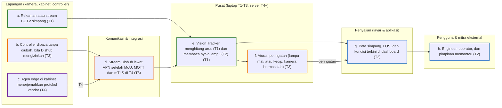

### F02 Rekomendasi dan penetapan waktu sinyal

Engineer mengonfigurasi simpang, sistem mengubah hitungan Vision Tracker menjadi arus SMP, menghitung kinerja dengan PKJI 2023, menjalankan mode optimasi, memvalidasinya di SUMO, lalu menyusun laporan. Rekomendasi diterapkan manual di T2, lewat lembar jadwal di T3, dan dikirim ke controller di T4.

Tahap yang terlibat: T1, T2, T3. Langkah dan komponennya:

| Langkah | Lapisan | Komponen | Tahap |
|---|---|---|---|
| a. Engineer mengisi konfigurasi simpang (formulir T1, wizard T2) | Pengguna | apps/tmc-web | T1 |
| b. Konversi hitungan ke arus SMP per periode (EMP PKJI 2023) | Pusat | services/optimizer | T1 |
| c. Kalkulator PKJI 2023: kapasitas, DJ, antrian, tundaan, LOS | Pusat | services/optimizer (NumPy) | T1 |
| d. Mode optimasi: Webster (T1); empat mode lain (T2); multi-kriteria (T3) | Pusat | services/optimizer (SciPy) | T1 |
| e. Validator keselamatan dan validasi SUMO eksisting vs rekomendasi | Pusat | sim/ (SUMO) | T2 |
| f. Dashboard rekomendasi, manfaat rupiah, laporan Word/PDF | Penyajian | apps/tmc-web, services/reports | T2 |
| g. Persetujuan Kepala Dinas; Dirjen/BPTJ bila jalan nasional | Pengguna | alur persetujuan | T2 |
| h. Petugas menerapkan waktu baru di controller | Lapangan | manual (T2), lembar jadwal (T3), NTCIP/adaptor (T4) | T2 |
| i. Uji lapangan sebelum-sesudah diukur Vision Tracker | Pusat | services/vision | T3 |

Versi teks (mermaid):

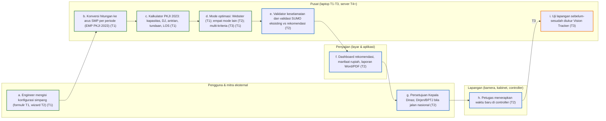

### F03 Kendali terpusat, mode manual petugas, dan cadangan saat putus

Mulai T4 operator atau petugas Polri memilih program atau mode manual dari ruang kendali. Pusat mengirim perintah terbatas beserta detak jantung. Bila jaringan putus, controller kembali ke jadwal lokal dan semua kejadian tetap tercatat.

Tahap yang terlibat: T4. Langkah dan komponennya:

| Langkah | Lapisan | Komponen | Tahap |
|---|---|---|---|
| a. Operator atau petugas Polri memilih program, kedip, atau mode manual | Pengguna | konsol kendali | T4 |
| b. Konsol kendali meminta konfirmasi dan alasan | Penyajian | apps/tmc-web | T4 |
| c. Layanan perintah memeriksa hak akses, mengirim perintah dan detak jantung | Pusat | services/cai | T4 |
| d. SNMP/MQTT lewat VPN | Komunikasi | infra/ | T4 |
| e. Controller menjalankan program; edge meneruskan detak jantung | Lapangan | controller, edge/ | T4 |
| f. Jaringan putus: controller kembali ke jadwal lokal; edge menyimpan catatan | Lapangan | controller, edge/ | T4 |
| g. Jejak audit perintah; alarm bila cadangan aktif | Pusat | audit log, services/health | T4 |

Versi teks (mermaid):

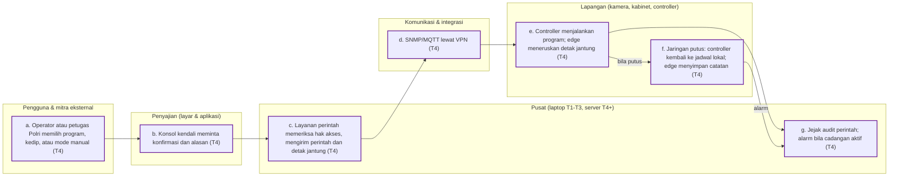

### F04 Kesehatan kamera dan perangkat, alarm, tiket kerja, dan pemeliharaan

Kamera bermasalah terdeteksi dari gambar mulai T3; alarm controller dan detektor mulai T4. Peringatan menjadi tiket kerja untuk teknisi. Jadwal pemeliharaan berkala dan umur teknis aset dijaga sesuai PM 49/2014.

Tahap yang terlibat: T3, T4. Langkah dan komponennya:

| Langkah | Lapisan | Komponen | Tahap |
|---|---|---|---|
| a. Kamera tertutup, gelap, buram, atau bergeser | Lapangan | kamera; dideteksi services/vision | T3 |
| b. Alarm controller, detektor, pintu kabinet, catu daya | Lapangan | controller, edge/ | T4 |
| c. Mesin peringatan: prioritas, eskalasi, notifikasi APILL mati | Pusat | services/health | T3 |
| d. Email/WhatsApp; API aduan kota | Komunikasi | integrasi | T3 |
| e. Tiket kerja otomatis dengan target waktu penyelesaian | Pusat | services/ticket | T3 |
| f. Aplikasi ponsel teknisi: tiket, checklist, foto | Penyajian | apps/tmc-web (PWA) | T4 |
| g. Jadwal pemeliharaan enam bulanan dan umur teknis lima tahun | Pusat | apps/api (aset) | T3 |
| h. Kepala Dinas melihat KPI kesehatan kamera dan perangkat | Pengguna | dashboard pimpinan | T3 |

Versi teks (mermaid):

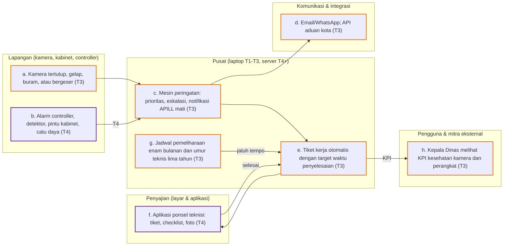

### F05 Pengukuran kinerja dan laporan

Hitungan dan status lampu dari Vision Tracker (kemudian juga log controller) diolah menjadi KPI resmi PKJI dan LOS PM 96/2015, perbandingan eksisting dan rekomendasi, laporan kajian (T2), dan laporan wajib ke Forum LLAJ, Dirjen/BPTJ, dan Gubernur (T3).

Tahap yang terlibat: T1, T2, T3, T4. Langkah dan komponennya:

| Langkah | Lapisan | Komponen | Tahap |
|---|---|---|---|
| a. Hitungan (T1), status lampu dan antrian (T2) dari Vision Tracker | Lapangan | services/vision | T1 |
| b. Log kejadian controller lewat MQTT | Komunikasi | infra/ | T4 |
| c. Simpan tabel 15 menit (T1), status lampu dan antrian (T2); retensi bertingkat | Pusat | PostgreSQL | T1 |
| d. Metrik kinerja sinyal (split failure, arrivals on green) | Pusat | services/metrics | T3 |
| e. KPI PKJI dan LOS PM 96; eksisting vs rekomendasi | Pusat | services/optimizer | T1 |
| f. Laporan kajian simpang (T2); laporan wajib (T3) | Pusat | services/reports | T2 |
| g. Dashboard pimpinan dan engineer; dashboard publik (T3) | Penyajian | apps/tmc-web | T2 |
| h. Pejabat, DPRD, Forum LLAJ, warga | Pengguna | (pihak luar) | T2 |

Versi teks (mermaid):

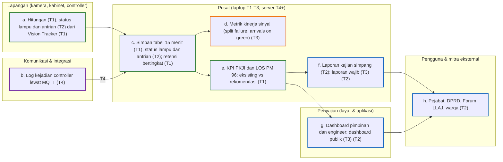

### F06 Pipeline Vision Tracker dan keluaran tabel hitungan

Vision Tracker mengubah rekaman atau stream CCTV menjadi tabel hitungan per kelas, per arah, dan per 15 menit, ditambah hambatan samping, nyala lampu, dan antrian. Penyamaran wajah dan pelat berlaku mulai T2. Mulai T3 ditambah deteksi kejadian dan kesehatan kamera. Di T4 Vision Tracker berjalan di perangkat edge dan pembacaan pelat memakai kamera ANPR khusus.

Tahap yang terlibat: T1, T2, T3, T4. Langkah dan komponennya:

| Langkah | Lapisan | Komponen | Tahap |
|---|---|---|---|
| a. Rekaman CCTV atau video publik (T1); stream RTSP/HLS (uji T2, Dishub T3) | Lapangan | berkas, MediaMTX | T1 |
| b. Ambil bingkai sekitar 10 per detik | Pusat | FFmpeg, OpenCV | T1 |
| c. Deteksi enam kelas dan pelacakan | Pusat | RF-DETR/YOLOX, ONNX Runtime, ByteTrack | T1 |
| d. Hitung per pendekat (T1) dan per arah dari lintasan (T2) | Pusat | supervision, services/vision | T1 |
| e. Hambatan samping berbobot PKJI, nyala lampu, antrian dasar | Pusat | services/vision | T2 |
| f. Tabel hitungan 15 menit dan mutu data; penyamaran video mulai T2 | Pusat | PostgreSQL, services/vision | T1 |
| g. Kendaraan prioritas, kejadian, pelanggaran, kesehatan kamera | Pusat | services/vision | T3 |
| h. Vision Tracker di edge 24 jam; ANPR kamera khusus | Lapangan | edge/ (Jetson/IPC) | T4 |
| i. Tabel dan dashboard dasar (T1); halaman kualitas data (T2) | Penyajian | apps/tmc-web | T1 |
| j. Engineer memeriksa dan mengoreksi | Pengguna | (pihak luar) | T1 |

Versi teks (mermaid):

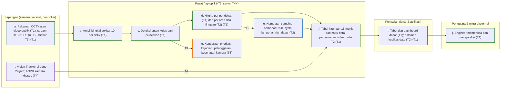

### F07 Kendali responsif dan adaptif

Mulai T4 detektor virtual dari kamera dipakai untuk actuated, pemilihan program menurut kondisi, dan offset dasar antar simpang berdekatan. Di T5 ditambah max-pressure jaringan dan pengendalian perimeter. Mode bayangan memastikan algoritma terbukti sebelum mengendalikan lampu.

Tahap yang terlibat: T4, T5. Langkah dan komponennya:

| Langkah | Lapisan | Komponen | Tahap |
|---|---|---|---|
| a. Detektor virtual kamera, loop, atau radar | Lapangan | edge/, controller | T4 |
| b. Gerbang kesehatan: adaptif hanya bila detektor sehat | Pusat | services/adaptive | T4 |
| c. Actuated dan pemilihan program per simpang (TRPS) | Pusat | services/adaptive | T4 |
| d. Offset dasar dan green wave sederhana simpang berdekatan | Pusat | services/adaptive | T4 |
| e. Max-pressure jaringan dan pengendalian perimeter | Pusat | services/network | T5 |
| f. Mode bayangan dan metrik kinerja sebagai pengamat | Pusat | shadow harness | T4 |
| g. Perintah lewat antarmuka controller | Komunikasi | services/cai | T4 |
| h. Controller menjalankan; jadwal lokal tetap cadangan | Lapangan | controller | T4 |
| i. Konsol adaptif: parameter, keputusan, nilai antara | Penyajian | apps/tmc-web | T4 |

Versi teks (mermaid):

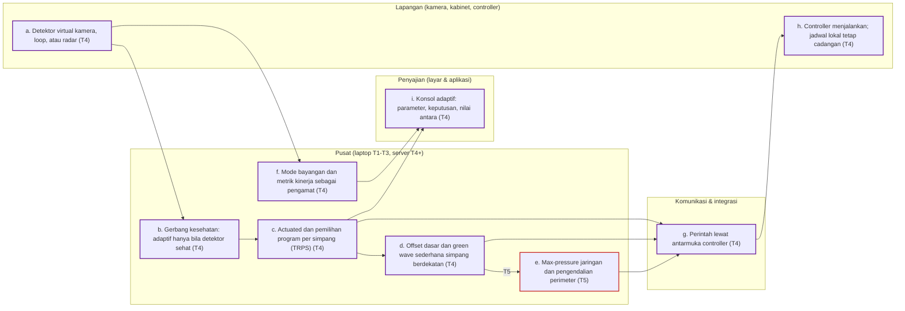

### F08 Prioritas bus dan kendaraan darurat

Vision Tracker mengenali kendaraan prioritas sejak T3. Mulai T4 permintaan prioritas dari pelacakan bus dan pusat komando pemadam atau ambulans dinilai, dijaga batas keselamatannya, lalu dilayani lewat controller. Prioritas bus bersyarat berbasis muatan di T5.

Tahap yang terlibat: T3, T4, T5. Langkah dan komponennya:

| Langkah | Lapisan | Komponen | Tahap |
|---|---|---|---|
| a. AVL/APC operator bus; CAD pemadam dan ambulans | Pengguna | operator bus, 112/119 | T4 |
| j. Vision Tracker mengenali ambulans, damkar, dan pengawalan dari kamera | Pusat | services/vision | T3 |
| b. API mitra sesuai dokumen antarmuka | Komunikasi | integrasi (ICD) | T4 |
| c. Layanan permintaan prioritas: kelayakan dan antrean | Pusat | services/priority | T4 |
| d. Prioritas bersyarat berbasis muatan dan keterlambatan | Pusat | services/priority | T5 |
| e. Batas: pejalan kaki tidak dipotong, satu aktivasi per siklus, pemulihan | Pusat | services/priority | T4 |
| f. Perintah perpanjangan hijau atau preemption | Komunikasi | services/cai | T4 |
| g. Controller memberi hijau tambahan atau preempt | Lapangan | controller, edge/ | T4 |
| h. Konsol prioritas: permintaan, dilayani, dampak jalan samping | Penyajian | apps/tmc-web | T4 |
| i. Log dan KPI waktu tempuh bus dan waktu tanggap darurat | Pusat | services/metrics | T4 |

Versi teks (mermaid):

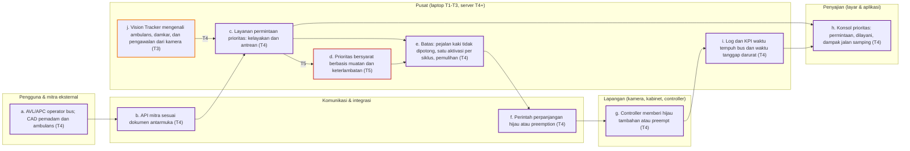

### F09 Bukti pelanggaran untuk ETLE Polri

Sistem hanya menyediakan bukti. Di T3 Vision Tracker mendeteksi pelanggaran tanpa membaca pelat. Di T4 kamera ANPR khusus dan API ke Back Office ETLE Polri ditambahkan; verifikasi dan penindakan tetap oleh petugas Polri.

Tahap yang terlibat: T3, T4. Langkah dan komponennya:

| Langkah | Lapisan | Komponen | Tahap |
|---|---|---|---|
| a. Vision Tracker mendeteksi terobos merah dan pelanggaran lain, tanpa pelat | Pusat | services/vision | T3 |
| b. Paket bukti: klip tersamarkan, waktu, lokasi | Pusat | services/evidence | T3 |
| c. Kontrol perlindungan data dan DPIA | Pusat | keamanan & kepatuhan | T3 |
| d. Pembacaan pelat dengan kamera ANPR khusus | Lapangan | kamera ANPR, edge/ | T4 |
| e. API ke Back Office ETLE sesuai Perpol 8/2023 | Komunikasi | integrasi (ICD Polri) | T4 |
| f. Petugas Polri memverifikasi dan menindak | Pengguna | Polri | T4 |
| g. Status tindak lanjut hanya-baca; laporan integrasi tahunan | Pusat | services/evidence | T4 |
| h. Dashboard keselamatan per simpang | Penyajian | apps/tmc-web | T3 |

Versi teks (mermaid):

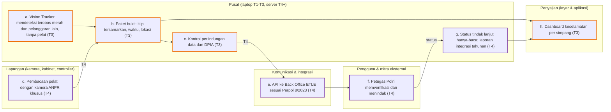

### F10 Keluhan publik dan jaminan layanan

Mulai T3 laporan warga masuk lewat aplikasi kota atau CRM, menjadi tiket dengan target waktu penyelesaian, dan didiagnosis dengan data Vision Tracker termasuk pemutaran ulang kondisi saat keluhan.

Tahap yang terlibat: T3. Langkah dan komponennya:

| Langkah | Lapisan | Komponen | Tahap |
|---|---|---|---|
| a. Warga melapor lewat aplikasi kota, CRM, atau telepon | Pengguna | CRM kota | T3 |
| b. API CRM dua arah | Komunikasi | integrasi CRM | T3 |
| c. Tiket, klasifikasi, target penyelesaian | Pusat | services/ticket | T3 |
| d. Diagnosis: jenis keluhan dipetakan ke data hitungan dan nyala lampu | Pusat | services/metrics | T3 |
| e. Pemutaran ulang kondisi saat keluhan | Pusat | PostgreSQL | T3 |
| f. Operator menindaklanjuti; tiket kerja bila perlu | Penyajian | apps/tmc-web | T3 |
| g. Jawaban ke pelapor; status dapat dilihat publik | Pengguna | CRM kota, dashboard publik | T3 |

Versi teks (mermaid):

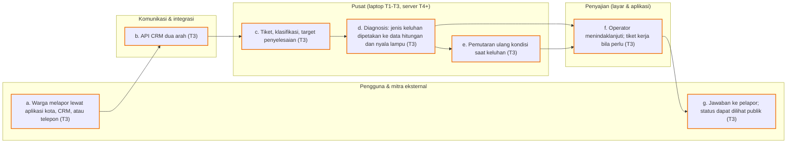

### F11 Simulasi SUMO, digital twin, dan mode bayangan

Sejak T2 setiap rekomendasi diuji di SUMO dengan jaringan yang dibangun dari konfigurasi simpang. T3 mengkalibrasi twin per simpang dengan hitungan Vision Tracker. T4 menambah mode bayangan untuk algoritma adaptif. T5 membuka pasar algoritma.

Tahap yang terlibat: T2, T3, T4, T5. Langkah dan komponennya:

| Langkah | Lapisan | Komponen | Tahap |
|---|---|---|---|
| a. Jaringan simulasi dibangun dari konfigurasi simpang atau OSM | Pusat | sim/ | T2 |
| b. Kalibrasi twin per simpang dengan hitungan Vision Tracker | Pusat | sim/ | T3 |
| c. Skenario: jadwal baru (T2), insiden dan acara (T4), kebijakan TDM (T5) | Pusat | sim/ | T2 |
| d. Pekerja simulasi menjalankan beberapa bilangan acak | Pusat | sim/ worker | T2 |
| e. Mode bayangan: algoritma menerima data hidup tanpa mengendalikan lampu | Pusat | shadow harness | T4 |
| f. Veto statistik dan uji konflik prioritas | Pusat | services/adaptive | T4 |
| g. Universitas atau vendor mengajukan algoritma | Pengguna | portal mitra | T5 |
| h. Promosi bertahap: jam sepi, jam sibuk, hidup-mati | Pusat | services/adaptive | T4 |
| i. Hasil validasi di dashboard dan laporan | Penyajian | apps/tmc-web | T2 |

Versi teks (mermaid):

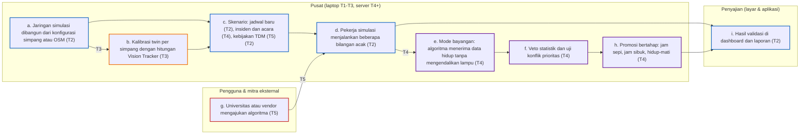

### F12 Platform banyak kota, data terbuka, dan pengelolaan permintaan perjalanan

Di T5 satu platform melayani banyak kota dengan data terpisah, membandingkan kinerja antar kota, mengoptimasi koridor dan jaringan, menghitung ambang legal kebijakan pembatasan, dan membuka data lewat API publik.

Tahap yang terlibat: T4, T5. Langkah dan komponennya:

| Langkah | Lapisan | Komponen | Tahap |
|---|---|---|---|
| a. Kota-kota sebagai tenant; Kemenhub/BPTJ; provinsi | Pengguna | tenant | T5 |
| b. Isolasi data per tenant dan yurisdiksi | Pusat | apps/api | T4 |
| c. Optimasi koridor dan jaringan (bandwidth, Link Pivot, perimeter) | Pusat | services/network | T5 |
| d. Benchmark antar kota; kalkulator ambang kebijakan pembatasan | Pusat | services/tdm | T5 |
| e. Penasihat pembelajaran mesin yang hanya mengusulkan parameter | Pusat | services/advisor | T5 |
| f. API publik dan data terbuka; integrasi ERP dan ganjil-genap | Komunikasi | API gateway | T5 |
| g. Portal data terbuka dan dashboard benchmark | Penyajian | apps/tmc-web | T5 |
| h. Aplikasi navigasi, peneliti, warga | Pengguna | (pihak luar) | T5 |

Versi teks (mermaid):

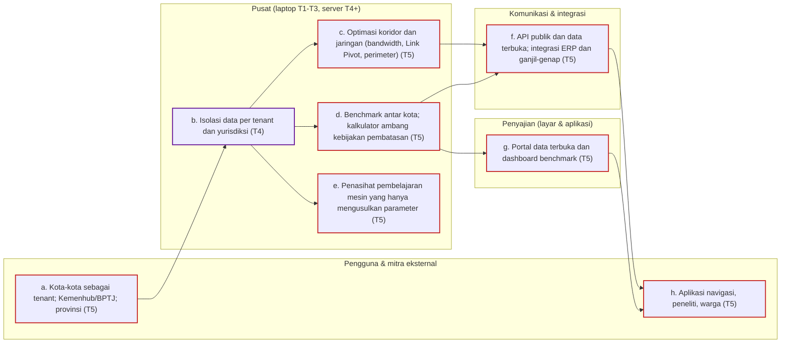
