## 1. Arsitektur alur data, komponen, dan teknologi (A01)

Diagram A01 merangkum alur kerja IRAMA dari kamera sampai keputusan. Video dari CCTV diolah Vision Tracker menjadi tabel hitungan per kelas kendaraan, per arah, dan per 15 menit. Tabel itu disimpan bersama konfigurasi simpang, lalu diolah modul Optimasi Waktu Simpang menjadi rekomendasi waktu siklus dan waktu hijau. Hasilnya tampil di dashboard dan laporan kajian sebagai bahan keputusan engineer dan Kepala Dinas. Setiap kotak mencantumkan teknologi yang dipakai dalam huruf miring.

Cara membaca diagram:

- Label warna di pojok kanan atas kotak menunjukkan tahap saat komponen itu pertama tersedia. T1 hijau, T2 biru, T3 jingga, T4 ungu, T5 merah.
- Untuk melihat kondisi sistem pada tahap tertentu, abaikan kotak dengan tahap lebih tinggi. Pada T2, misalnya, alur berjalan dari rekaman atau stream uji, melalui Vision Tracker dan optimasi, sampai dashboard, laporan, keputusan, dan penerapan manual oleh petugas.
- Panah tegak di dalam kolom menunjukkan urutan proses. Panah antarkolom menunjukkan data yang berpindah ke bagian berikutnya.
- Garis jingga di bawah kolom adalah jalur kejadian mulai T3. Peristiwa seperti ambulans lewat atau kamera tertutup langsung dikirim ke konsol pemantauan tanpa melalui optimasi.
- Garis putus-putus adalah umpan balik mulai T3. Setelah jadwal baru diterapkan, rekaman sesudahnya diukur ulang untuk membuktikan perubahan kinerja simpang.

Rincian komponen, teknologi, dan tahap:

| Kolom | Komponen | Teknologi | Tahap |
|---|---|---|---|
| Sumber video | Rekaman CCTV dan video publik | MP4/MKV, register sumber rekaman | T1 |
| Sumber video | Stream CCTV | RTSP/HLS/ONVIF; uji lewat MediaMTX (T2), stream Dishub setelah MoU (T3) | T2 |
| Vision Tracker | Ambil bingkai | FFmpeg, OpenCV | T1 |
| Vision Tracker | Deteksi enam kelas kendaraan | RF-DETR/YOLOX lewat ONNX Runtime (CPU/iGPU) | T1 |
| Vision Tracker | Pelacakan dan hitung per pendekat | ByteTrack, supervision; arah dari lintasan (T2) | T1 |
| Vision Tracker | Hambatan samping, nyala lampu, antrian | logika IRAMA, OpenCV; penyamaran wajah dan pelat | T2 |
| Vision Tracker | Kejadian dan kesehatan kamera | model tambahan, aturan peringatan | T3 |
| Data terstruktur | Tabel hitungan 15 menit dan mutu data | PostgreSQL | T1 |
| Data terstruktur | Hambatan samping, status lampu, antrian | PostgreSQL (TimescaleDB opsional) | T2 |
| Data terstruktur | Konfigurasi simpang dan parameter | formulir (T1), wizard React + MapLibre (T2); PostgreSQL + PostGIS | T1 |
| Data terstruktur | Peristiwa kejadian dan kesehatan kamera | PostgreSQL, klip bukti tersamarkan | T3 |
| Optimasi waktu simpang | Konversi SMP dan periode | Python, EMP PKJI 2023; periode otomatis (T2) | T1 |
| Optimasi waktu simpang | Kalkulator PKJI 2023 | NumPy, modul PKJI IRAMA; mode MKJI 1997 (T2) | T1 |
| Optimasi waktu simpang | Mode optimasi | SciPy; Webster (T1), empat mode (T2), multi-kriteria (T3) | T1 |
| Optimasi waktu simpang | Validasi simulasi | SUMO, TraCI | T2 |
| Optimasi waktu simpang | Manfaat rupiah | parameter UMK, BBM, emisi | T2 |
| Penyajian dan keputusan | Dashboard simpang | React, ECharts; versi dasar (T1), tiga halaman (T2) | T1 |
| Penyajian dan keputusan | Laporan kajian Word/PDF | python-docx, LibreOffice | T2 |
| Penyajian dan keputusan | Keputusan engineer dan Kepala Dinas | persetujuan dan jejak audit | T2 |
| Penyajian dan keputusan | Konsol pemantauan kejadian | React; notifikasi email/WhatsApp | T3 |
| Tindak lanjut | Penerapan manual oleh petugas | lembar jadwal dari dashboard atau laporan | T2 |
| Tindak lanjut | Ekspor jadwal dan uji sebelum-sesudah | format tabel, NTCIP baca-saja | T3 |
| Tindak lanjut | Kendali controller dan adaptif | adaptor NTCIP/vendor, edge, MQTT | T4 |
| Tindak lanjut | Koordinasi koridor dan jaringan | offset, bandwidth, Link Pivot; twin kota | T5 |
| Tindak lanjut | Tiket kerja dan tindak lanjut kejadian | tiket, email/WhatsApp, laporan wajib | T3 |

Versi teks (mermaid):

```mermaid
flowchart LR
  subgraph C0["Sumber video"]
    V1["Rekaman CCTV dan video publik (T1)<br/><i>MP4/MKV, register sumber rekaman</i>"]
    V2["Stream CCTV (T2)<br/><i>RTSP/HLS/ONVIF; uji lewat MediaMTX (T2), stream Dishub setelah MoU (T3)</i>"]
  end
  subgraph C1["Vision Tracker"]
    A1["Ambil bingkai (T1)<br/><i>FFmpeg, OpenCV</i>"]
    A2["Deteksi enam kelas kendaraan (T1)<br/><i>RF-DETR/YOLOX lewat ONNX Runtime (CPU/iGPU)</i>"]
    A3["Pelacakan dan hitung per pendekat (T1)<br/><i>ByteTrack, supervision; arah dari lintasan (T2)</i>"]
    A4["Hambatan samping, nyala lampu, antrian (T2)<br/><i>logika IRAMA, OpenCV; penyamaran wajah dan pelat</i>"]
    A5["Kejadian dan kesehatan kamera (T3)<br/><i>model tambahan, aturan peringatan</i>"]
  end
  subgraph C2["Data terstruktur"]
    D1["Tabel hitungan 15 menit dan mutu data (T1)<br/><i>PostgreSQL</i>"]
    D2["Hambatan samping, status lampu, antrian (T2)<br/><i>PostgreSQL (TimescaleDB opsional)</i>"]
    D3["Konfigurasi simpang dan parameter (T1)<br/><i>formulir (T1), wizard React + MapLibre (T2); PostgreSQL + PostGIS</i>"]
    D4["Peristiwa kejadian dan kesehatan kamera (T3)<br/><i>PostgreSQL, klip bukti tersamarkan</i>"]
  end
  subgraph C3["Optimasi waktu simpang"]
    O1["Konversi SMP dan periode (T1)<br/><i>Python, EMP PKJI 2023; periode otomatis (T2)</i>"]
    O2["Kalkulator PKJI 2023 (T1)<br/><i>NumPy, modul PKJI IRAMA; mode MKJI 1997 (T2)</i>"]
    O3["Mode optimasi (T1)<br/><i>SciPy; Webster (T1), empat mode (T2), multi-kriteria (T3)</i>"]
    O4["Validasi simulasi (T2)<br/><i>SUMO, TraCI</i>"]
    O5["Manfaat rupiah (T2)<br/><i>parameter UMK, BBM, emisi</i>"]
  end
  subgraph C4["Penyajian dan keputusan"]
    P1["Dashboard simpang (T1)<br/><i>React, ECharts; versi dasar (T1), tiga halaman (T2)</i>"]
    P2["Laporan kajian Word/PDF (T2)<br/><i>python-docx, LibreOffice</i>"]
    P3["Keputusan engineer dan Kepala Dinas (T2)<br/><i>persetujuan dan jejak audit</i>"]
    P4["Konsol pemantauan kejadian (T3)<br/><i>React; notifikasi email/WhatsApp</i>"]
  end
  subgraph C5["Tindak lanjut"]
    R1["Penerapan manual oleh petugas (T2)<br/><i>lembar jadwal dari dashboard atau laporan</i>"]
    R2["Ekspor jadwal dan uji sebelum-sesudah (T3)<br/><i>format tabel, NTCIP baca-saja</i>"]
    R3["Kendali controller dan adaptif (T4)<br/><i>adaptor NTCIP/vendor, edge, MQTT</i>"]
    R4["Koordinasi koridor dan jaringan (T5)<br/><i>offset, bandwidth, Link Pivot; twin kota</i>"]
    R5["Tiket kerja dan tindak lanjut kejadian (T3)<br/><i>tiket, email/WhatsApp, laporan wajib</i>"]
  end
  V1 --> A1
  V2 --> A1
  A1 --> A2
  A2 --> A3
  A3 --> A4
  A4 --> A5
  A3 --> D1
  A4 --> D2
  A5 --> D4
  D1 --> O1
  D2 --> O2
  D3 --> O2
  O1 --> O2
  O2 --> O3
  O3 --> O4
  O4 --> O5
  O3 --> P1
  O4 --> P1
  O5 --> P1
  P1 --> P2
  P2 --> P3
  P3 --> R1
  P3 --> R2
  P3 --> R3
  R3 --> R4
  P4 --> R5
  D4 -->|T3: peristiwa kejadian langsung ke konsol pemantauan, tanpa melalui optimasi| P4
  R2 -.->|T3: uji sebelum-sesudah; rekaman sesudah penerapan diukur ulang oleh Vision Tracker| V2
```

